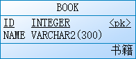
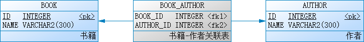

# 数据访问

这里罗列了几个工程，用于探讨多表操作相关内容，例如一对多，多对多等。

## 环境约定

所有工程基于以下技术：

* JDK 1.8+
* Intellij IDEA ce 2018.1
* Maven 3.5.2
* Spring Boot 2.0.0.RELEASE
* JPA
* H2
* Lombok

## 数据库

当前使用 H2 内存数据库，配置方式如下：

```sql
## jpa settings
spring.jpa.generate-ddl=true
spring.jpa.hibernate.ddl-auto=update
spring.jpa.properties.hibernate.format_sql=false
spring.jpa.show-sql=true
```

如需使用实体数据库，可参考如下：

```sql
## datasource settings
spring.datasource.driver-class-name=org.h2.Driver
spring.datasource.password=demo
spring.datasource.url=jdbc:h2:tcp://127.0.0.1/~/jpa-h2
spring.datasource.username=demo
## jpa settings
spring.jpa.generate-ddl=true
spring.jpa.hibernate.ddl-auto=update
spring.jpa.properties.hibernate.format_sql=false
spring.jpa.show-sql=true
```

## 工程说明

以下 6 个工程，各自独立，可按需阅读，亦可按索引逐条阅读：

| 索引 | 工程 | 标签 | 具体用法参考 |
| :--: | :--- | :--- | :--- |
| 1 | single-talbe | 单表 | AppRunner 和 ApplicationTests |
| 2 | one-to-one-shared-primary-key | 两张表，一对一，共享主键 | ApplicationTests |
| 3 | one-to-one-foreign-key | 两张表，一对一，外键 | ApplicationTests |
| 4 | one-to-many | 两张表：一对多 | AppRunner |
| 5 | many-to-many | 两张表：多对多 | AppRunner 和 ApplicationTests |
| 6 | many-to-many-extra-columns | 两张表：多对多，关联表含扩展字段 | AppRunner 和 ApplicationTests |

> 单表：书籍



> 一对一：书籍和书籍详情的关系
> * 约定：一本书籍最多存在一条书籍详情记录，一条书籍详情记录最多只适用于一本书
> * 说明：两种情况，一个是共享主键，一个是采用外键


> 一对多：出版社和书籍的关系
> * 约定：一个出版社可以出版多本书籍，一本书籍最多只在一个出版社发表
> * 说明：如果你认为一本书籍可以在多个出版社发表，那么应该阅读多对多关系


> 多对多：书籍和作者的关系
> * 约定：一本书籍可以由多个作者合著，一位作者可以发表多本书籍
> * 说明：两种情况，一个是关联表只包含外键，一个是关联表扩展了部分字段




## 总结

在项目中，用得比较多的，应该是：**单表**、**一对多**、**多对多**。而**一对一**只在小部分场景下适用，**多对多**的关联表扩展字段用得也相对少点。

所以，这里不讨论数据查询的相关问题，例如条件过滤，分页，排序等。
